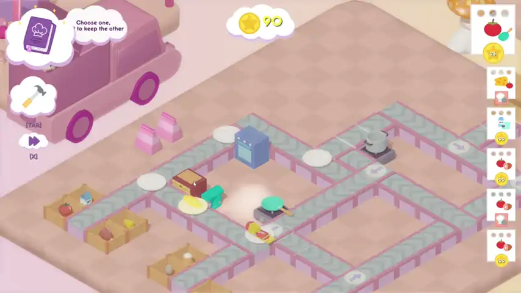
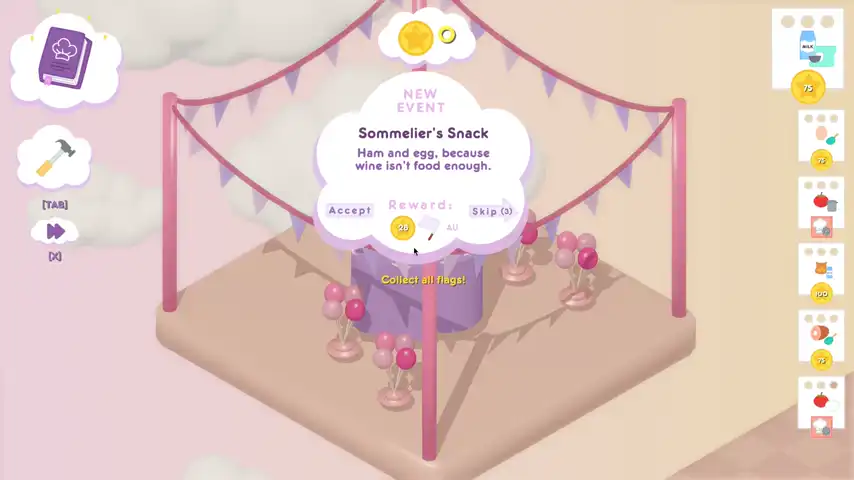

# Cook me back
> Sweet dreams are made of greens...

**This game was created for the ZTGK 2026 competition in the Game Development category.**

## About the Game
**Cook me back** is a relaxing tower defense game in which a frustrated chef, trapped in a deep sleep, automates his restaurant and recruits vegetable guests as helpers. Through culinary experiments, he must discover all recipes to awaken and return to reality.

## Gameplay

## Editor

## AI Quest Generation
*Our custom generative system leverages LLMs to fetch real-world news and transform them into unique, surreal quests. This ensures an endless pool of absurd and engaging tasks that fit the game's dreamlike atmosphere.*

## Tech Stack
The game is built on a custom engine called **CookingStation**.
* **Programming Language:** C++ 17
* **Graphics Engine / API:** OpenGL
* **Physics:** Custom system (AABB collision detection and raycasting)
* **Audio:** Miniaudio
* **Other Libraries:** GLFW, Glad, Assimp, Spdlog, Nlohmann/json

## Features
* ECS (Entity Component System) architecture
* Virtual File System (VFS)
* 3D rendering and animation system with skeletal animation support
* Dynamic Pathfinding (A-Star) for AI
* Drag-and-Drop system with grid snapping
* Generative system based on LLMs to create unique quests from real-world news
* Native C++ scripting

## Play the Game
You can download and play the latest version of the game on our itch.io page:

**[Play "Cook me back" on itch.io](https://raspberrycola.itch.io/cook-me-back)**
